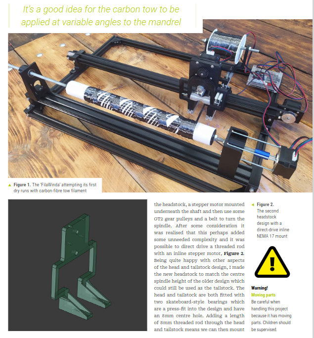

# Fila_Winda

  

A prototype desktop carbon fibre filament winding machine

S0me documentation is available as Fila_Winda appeared in Raspberry Pi magazines issues 150 and 151. You can download them both for free here https://magazine.raspberrypi.com/issues
